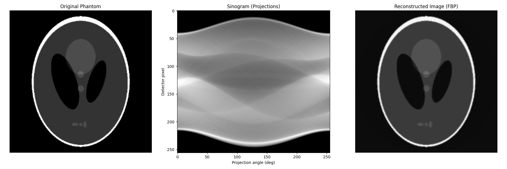

# 🧠 CT Reconstruction using Filtered Back Projection (FBP)

This project demonstrates how to simulate Computed Tomography (CT) image reconstruction using the **Filtered Back Projection (FBP)** algorithm in Python. It uses a synthetic medical image known as the **Shepp-Logan Phantom**, a standard test pattern in tomography, and reconstructs the original image from its projections using the **Radon transform** and **Inverse Radon transform**.

## 📑 Table of Contents

- [Background](#background)
  - [Radon Transform](#radon-transform)
  - [Filtered Back Projection (FBP)](#filtered-back-projection-fbp)
- [Algorithm Overview](#algorithm-overview)
- [Dependencies](#dependencies)
- [Example Output](#example-output)
  - [Original Phantom](#original-phantom)
  - [Sinogram (Radon Transform)](#sinogram-radon-transform)
  - [Reconstructed Image](#reconstructed-image)
- [Use Cases](#use-cases)
- [Future Work](#future-work)
- [Author](#author)
- [References](#references)

---

## Background

**Computed Tomography (CT)** is a medical imaging technique where a series of X-ray images are taken from different angles around a subject. These are then used to reconstruct cross-sectional views (slices) of the internal structure.

### Radon Transform
The **Radon transform** computes the projection of an image along specified angles, simulating how X-rays pass through tissue in a CT scan. The collection of projections from multiple angles forms a **sinogram**.

### Filtered Back Projection (FBP)
FBP is a classical method used to reconstruct images from their sinograms. It involves two steps:
1. **Filtering** the sinogram to correct for distortion.
2. **Back-projecting** each filtered projection across the image domain to form the final image.

---

## Algorithm Overview

1. **Generate Phantom**: Create a 2D Shepp-Logan Phantom image.
2. **Preprocessing**: Pad or resize the phantom to a square size suitable for Radon transform.
3. **Projection**: Use the Radon transform to simulate projection data at multiple angles.
4. **Reconstruction**: Apply the inverse Radon transform using the FBP method.
5. **Visualization**: Display the original image, the sinogram, and the reconstructed result.

---

## Dependencies

Install the required libraries:

```bash
pip install numpy matplotlib scikit-image scipy
```


## Example Output

The code will display the following:


### Original Phantom
A synthetic CT slice used as the input image.

---

### Sinogram (Radon Transform)
The simulated X-ray projections collected at angles from 0 to 180 degrees.

### Reconstructed Image
An approximation of the original image using the filtered back projection algorithm.

You should see a 3-panel figure showing:
- The original phantom
- The sinogram
- The FBP reconstruction



---

## Use Cases

- Teaching medical imaging concepts
- Visualizing tomography and inverse problems
- Validating CT reconstruction algorithms
- Rapid prototyping of imaging pipelines
- Computational physics simulations

---

## Future Work

- Support for custom phantoms or real CT/DICOM data
- Implementation of alternative reconstruction methods (e.g., SIRT, ART)
- Performance benchmarking and noise analysis

---

## Author

This project was created by [Dexter575](https://github.com/Dexter575) as part of the **TuringLab** collection for computational simulation and scientific computing.

---

## References

- [Radon Transform - Wikipedia](https://en.wikipedia.org/wiki/Radon_transform)
- [Shepp-Logan Phantom - Wikipedia](https://en.wikipedia.org/wiki/Shepp–Logan_phantom)
- [Scikit-Image Documentation](https://scikit-image.org/)
